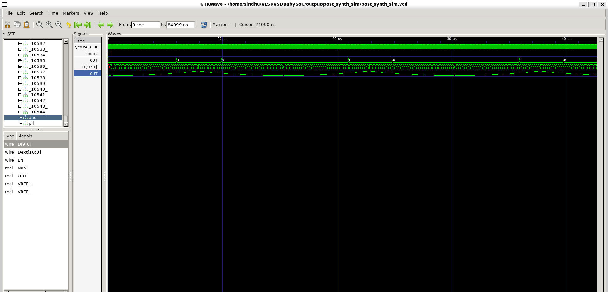

## 🧩 Week 3 — Task 1: Post-Synthesis GLS 

### 🎯 **Objective**

To understand and perform **Gate-Level Simulation (GLS)** after synthesis, validate functionality, and get introduced to **Static Timing Analysis (STA)** concepts with practical experiments using **OpenSTA**.

---

### ⚙️ **Part 1 — Post-Synthesis GLS**

#### 🔍 What is Post-Synthesis GLS?

Gate-Level Simulation (GLS) is a **simulation performed on the synthesized netlist** to verify that the design’s logical behavior remains identical after synthesis.
It includes **propagation delays (via SDF/unit delays)** and checks for **metastability and timing conditions** that may not appear in RTL simulation.

#### 🧠 Why Perform GLS?

* To verify that synthesis **did not alter functional behavior**.
* To ensure **timing annotations (SDF/unit delays)** are properly met.
* To validate the design under **realistic gate-level conditions**.

---

### 🧩 **Reference**

* Example GLS flow: [VSD_HDP – Day 6](https://github.com/Ananya-KM/VSD_HDP/blob/main/Day%206.md)

---

### 🧰 **Procedure**

#### **Step 1: Load Top-Level Design and Supporting Modules**

```bash
yosys
```

```bash
read_liberty -lib ~/VLSI/VSDBabySoC/src/lib/avsdpll.lib
read_liberty -lib ~/VLSI/VSDBabySoC/src/lib/avsddac.lib
read_liberty -lib ~/VLSI/VSDBabySoC/src/lib/sky130_fd_sc_hd__tt_025C_1v80.lib
```

**Output:**

```
Imported 1 cell types from avsdpll.lib
Imported 1 cell types from avsddac.lib
Imported 428 cell types from sky130_fd_sc_hd__tt_025C_1v80.lib
```

#### **Step 2: Load Verilog Source Files**

```bash
read_verilog /home/sindhu/VLSI/VSDBabySoC/src/module/vsdbabysoc.v
read_verilog -I /home/sindhu/VLSI/VSDBabySoC/src/include /home/sindhu/VLSI/VSDBabySoC/src/module/rvmyth.v
read_verilog -I /home/sindhu/VLSI/VSDBabySoC/src/include /home/sindhu/VLSI/VSDBabySoC/src/module/clk_gate.v
```

**Observations:**

* Successfully parsed all modules (`vsdbabysoc`, `rvmyth`, `clk_gate`).
* Warnings on memory replacement in `rvmyth` are expected (RAM flattening).

---

### 🧮 **Step 3: Run Synthesis Targeting `vsdbabysoc`**

```bash
synth -top vsdbabysoc
```

(Logs saved as `statbeforemapping.log`)

---

### 🧩 **Step 4: Map D Flip-Flops to Standard Cells**

```bash
dfflibmap -liberty /home/sindhu/VLSI/VSDBabySoC/src/lib/sky130_fd_sc_hd__tt_025C_1v80.lib
```

---

### ⚙️ **Step 5: Optimization and Technology Mapping**

```bash
opt
abc -liberty /home/sindhu/VLSI/VSDBabySoC/src/lib/sky130_fd_sc_hd__tt_025C_1v80.lib
```

---

### 🧹 **Step 6: Final Clean-Up and Renaming**

```bash
flatten
setundef -zero
clean -purge
rename -enumerate
```

---

### 📊 **Step 7: Check Statistics**

```bash
stat
```

(Logs saved as `statafteropt.log`)

---

### 📝 **Step 8: Write the Synthesized Netlist**

```bash
write_verilog -noattr /home/sindhu/VLSI/VSDBabySoC/output/post_synth_sim/vsdbabysoc.synth.v
```

---

## 🧠 Post-Synthesis Simulation and Waveforms

### **Step 1: Compile the Testbench**

```bash
iverilog -o /home/sindhu/VLSI/VSDBabySoC/output/post_synth_sim/post_synth_sim.out \
-DPOST_SYNTH_SIM -DFUNCTIONAL -DUNIT_DELAY=#1 \
-I /home/sindhu/VLSI/VSDBabySoC/src/include \
-I /home/sindhu/VLSI/VSDBabySoC/src/module \
-I /home/sindhu/VLSI/VSDBabySoC/output/synth \
-I /home/sindhu/VLSI/VSDBabySoC/src/gls_model \
/home/sindhu/VLSI/VSDBabySoC/src/gls_model/primitives.v \
/home/sindhu/VLSI/VSDBabySoC/src/gls_model/sky130_fd_sc_hd.v \
/home/sindhu/VLSI/VSDBabySoC/src/module/testbench.v
```

### **Step 2: Run Simulation**

```bash
vvp /home/sindhu/VLSI/VSDBabySoC/output/post_synth_sim/post_synth_sim.out
```

**Output:**

```
VCD info: dumpfile post_synth_sim.vcd opened for output.
```

### **Step 3: View in GTKWave**

```bash
gtkwave post_synth_sim.vcd
```

---

### 📈 **Results**

**GLS = Functional Simulation Output**

The post-synthesis simulation waveform matches the functional simulation waveform from Week 2.

**Screenshot:**



---

### 🧾 **Deliverables**

* ✅ Synthesis logs: `statbeforemapping.log`, `statafteropt.log`
* ✅ Synthesized netlist: `vsdbabysoc.synth.v`
* ✅ GLS waveform screenshot (`post.png`)
* ✅ Confirmation: **GLS = Functional outputs**

