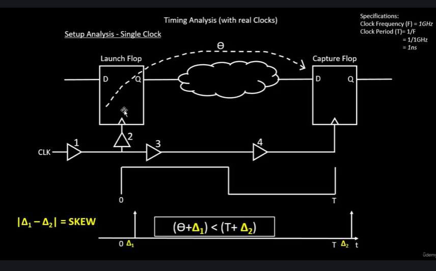

# Week 3 Task 2 – STA (Static Timing Analysis) Fundamentals

## 🎯 Objective
To understand the fundamentals of **Static Timing Analysis (STA)** — including setup and hold checks, slack, clock definitions, and path-based analysis — and summarize key learnings from the STA Fundamentals course with supporting visual explanations.

---

## 📘 Introduction
**Static Timing Analysis (STA)** is a method used to validate the timing performance of a digital circuit without requiring simulation.  
It checks whether a design meets its timing constraints under different conditions by analyzing **timing paths**, **delays**, and **constraints**.

STA consists of three main components:

1. **Timing** – Setup and Hold checks  
2. **Constraints** – Defining expected behavior (clock periods, input/output delays)  
3. **Libraries** – Delay models describing gate behavior  
   - NLTM (Non-Linear Timing Model)  
   - CCS (Composite Current Source Model)

---

## 🧩 Timing Checks and Path Analysis

### 1. Timing Paths
A **timing path** represents the route that a signal takes from its **start point** to its **end point**.

- **Start Points:** Flip-flop clock pins or input ports  
- **End Points:** Flip-flop data pins or output ports  

Each valid timing path is analyzed for both **setup** and **hold** conditions.

---

### 2. Arrival and Required Times
- **Arrival Time (AT):**  
  The actual time a signal takes to reach the endpoint from the start point.

- **Required Time (RT):**  
  The expected time by which a signal must arrive at the endpoint (based on constraints).

For correct operation:  
`Arrival Time = Required Time`

---

### 3. Slack
**Slack** = Required Time − Arrival Time  

- **Positive Slack:** Timing met  
- **Zero Slack:** Perfectly met constraint  
- **Negative Slack:** Timing violation  

| Type | Analysis | Condition | Meaning |
|------|-----------|------------|----------|
| Max Slack | Setup Analysis | Signal arrives too late | Setup Violation |
| Min Slack | Hold Analysis | Signal arrives too early | Hold Violation |

Example:  
If `0.5 ns < arrival time = 3.5 ns < 3 ns`, then  
**Max Slack = -0.5 ns** → setup violation.

---

## ⚙️ Types of STA Analysis

1. **Reg-to-Reg (Flip-Flop to Flip-Flop)**  
2. **In-to-Reg (Input to Flip-Flop)**  
3. **Reg-to-Out (Flip-Flop to Output)**  
4. **In-to-Out (Input to Output)**  
5. **Clock Gating (Clock → Gate Output)**  
   - Used for power optimization  
6. **Recovery / Removal (Reset timing)**  
7. **Data-to-Data**  
8. **Latch Analysis (Time Borrowing)**  

Latches are level-triggered and can **borrow time** between phases, improving performance at the cost of design complexity.

---

## 📈 Slew and Load Analysis

### Slew (Transition Time)
The maximum and minimum time taken by a signal to rise or fall between thresholds.  
- Checked at both **data** and **clock** points.

### Load Analysis
Ensures circuits can drive all connected components properly.  
- **Fanout Analysis**  
- **Capacitance Analysis**

---

## 🕒 Clock Analysis

1. **Clock Skew:**  
   Difference in clock arrival times between two points.  
2. **Clock Pulse Degradation:**  
   Clock waveform distortion affecting duty cycle and setup/hold margins.

---

## 📊 Example: Reg-to-Reg Setup Analysis

For a 1 GHz clock (T = 1 ns):  
The signal propagates through combinational logic between flip-flops.  

A **Directed Acyclic Graph (DAG)** is used to represent the circuit for timing propagation.

- **CAT (Computed Arrival Time):** Latest signal arrival time at a node.  
- **RAT (Required Arrival Time):** Latest expected transition time per clock period.  
- **Slack:** `S = RAT - CAT` (must be ≥ 0 for valid timing).

To meet design goals, every node must satisfy `AAT < RAT`.

---

## 🧠 Timing Analysis with Real Clocks

### Setup Analysis
Analyzes the latest time by which data must arrive before the next active clock edge.

- **Setup Time:** Interval before the clock edge during which the data must remain stable.  
- **Clock-to-Q Delay:** Delay from the launch flip-flop’s clock edge to its data output.  

### Hold Analysis
Ensures that data remains stable for a minimum period after the clock edge.

- **Hold Time:** Duration after the active clock edge during which the input must stay constant.  
- **Condition:** `Arrival Time > Required Time`  
- **Slack:** `Slack = AT - RT`  

---

## 🔍 Jitter and Eye Diagram

### Jitter
Temporal variation in clock period due to:
- Power supply noise  
- Voltage droop  
- Ground bounce  

This affects clock stability and can lead to setup/hold violations.

### Eye Diagram
Visual representation of signal integrity — overlapping clock cycles form an "eye" pattern.

- **Noise Margin:** Tolerance range for logic highs and lows.  
- **Clock Uncertainty:** Extra margin considered during STA to account for jitter.

Slack must always be **≥ 0** to ensure stable and accurate operation.

---

## ⚛️ Transistor-Level Implementation

### 1. Negative Latch
Captures input when the clock is **low**.  
### 2. Positive Latch
Captures input when the clock is **high**.

A **positive edge-triggered flip-flop** is built by cascading a negative and a positive latch (master-slave configuration).

---

## ⚙️ On-Chip Variations (OCV)

### Sources of Variation
1. **Etching Differences:**  
   Imperfect masks alter W/L ratios, affecting drain current.  
2. **Oxide Thickness:**  
   Non-uniform oxidation affects gate capacitance (Cox).  
3. **Propagation Delay Variations:**  
   Delay depends on transistor resistance and current drive.

### OCV Derates
Adjust delay estimates to account for real-world process variations.

#### Example
- **Clock Pull-In:** Data required time reduced  
- **Clock Push-Out:** Data arrival time increased  

---

## 🧩 Pessimism Removal

### Setup Analysis After Pessimism Removal
- No cell can have two different delay values simultaneously.  
- Delay at a specific time instant is unified for analysis.  

### Hold Analysis After Pessimism Removal
- Similar removal applied to reduce unnecessary pessimism in hold checks.  

---

## ✅ Conclusion
Through this task, STA fundamentals were explored — including **setup/hold analysis**, **timing graphs**, **jitter**, **OCV effects**, and **latch-based timing behavior**.  
Understanding these concepts is essential for timing closure in VLSI design, ensuring that post-synthesis circuits meet both **functional** and **timing** requirements.

---

