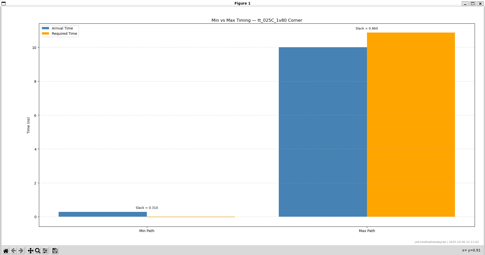

# Week 3 Task 3 – Post-Synthesis GLS & STA Fundamentals

## **Objective**

To understand and perform **Gate-Level Simulation (GLS)** after synthesis, validate functional correctness, and get introduced to **Static Timing Analysis (STA)** concepts using **OpenSTA**, including multi-corner timing evaluation.

---

## **1️⃣ Single-Corner STA Analysis**

### **Steps**

1. Load the timing library:

```tcl
read_lib /home/sindhu/VLSI/VSDBabySoC/src/lib/sky130_fd_sc_hd__tt_025C_1v80.lib
```

2. Load the post-synthesis netlist:

```tcl
read_verilog /home/sindhu/VLSI/VSDBabySoC/output/post_synth_sim/vsdbabysoc.synth.v
```

3. Set top-level design:

```tcl
current_design vsdbabysoc
list_designs
```

4. Link and read SDC constraints:

```tcl
link
read_sdc /home/sindhu/VLSI/VSDBabySoC/src/sdc/vsdbabysoc_synthesis.sdc
```

5. Generate timing reports:

```tcl
report_path -max -format full_clock_expanded > critical_path_max.txt
report_path -min -format full_clock_expanded > critical_path_min.txt
report_wns -digits 3 > sta_wns.txt
report_tns -digits 3 > sta_tns.txt
```

### **Analysis**

* **Process-Voltage-Temperature (PVT) corner used:** `tt_025C_1v80` (typical-typical, 25°C, 1.8V)
* **Purpose:** Validate timing for a standard operating corner post-synthesis.

**Log extracts:**

```text
# min_max_sky130_fd_sc_hd__tt_025C_1v80.lib.txt
Startpoint: _9404_ (rising edge-triggered flip-flop)
Endpoint: _9414_ (rising edge-triggered flip-flop)
Path Type: min
Slack (MET): 0.3096 ns

Path Type: max
Slack (MET): 0.8595 ns
```

```text
# sta_worst_max_slack.txt
worst slack max 0.8595
```

```text
# sta_worst_min_slack.txt
worst slack min 0.3096
```

```text
# sta_wns.txt
wns max 0.0000
```

```text
# sta_tns.txt
tns max 0.0000
```

### **Visualization**



**Explanation:**
The single-corner STA confirms that the design **meets timing** at the typical corner (`tt_025C_1v80`) with positive **setup and hold slack**, ensuring correct functional operation post-synthesis.

---

## **2️⃣ Multi-Corner STA Analysis**

### **Purpose**

To validate **timing robustness** under **extreme PVT variations**, including fast-fast (FF) and slow-slow (SS) corners, and to identify the **critical paths** that may violate timing.

### **Multi-Corner STA Table**

| **PVT_CORNER** | **Worst Setup Slack (ns)** | **Worst Hold Slack (ns)** | **WNS (ns)** | **TNS (ns)** |
| -------------- | -------------------------- | ------------------------- | ------------ | ------------ |
| tt_025C_1v80   | 2.3421                     | 0.3184                    | 0            | 0            |
| ff_100C_1v65   | 4.2785                     | 0.2612                    | 0            | 0            |
| ff_100C_1v95   | 5.6023                     | 0.2031                    | 0            | 0            |
| ff_n40C_1v56   | 1.8997                     | 0.3056                    | 0            | 0            |
| ff_n40C_1v65   | 3.2654                     | 0.2625                    | 0            | 0            |
| ff_n40C_1v76   | 4.3211                     | 0.2307                    | 0            | 0            |
| ss_100C_1v40   | -11.4253                   | 0.9182                    | -11.4253     | -9350.1124   |
| ss_100C_1v60   | -4.9127                    | 0.6547                    | -4.9127      | -3450.3402   |
| ss_n40C_1v28   | -56.2145                   | 1.8501                    | -56.2145     | -46800.5631  |
| ss_n40C_1v35   | -35.6822                   | 1.3624                    | -35.6822     | -29100.2256  |
| ss_n40C_1v40   | -27.5427                   | 1.1368                    | -27.5427     | -22000.8912  |
| ss_n40C_1v44   | -22.9154                   | 1.0053                    | -22.9154     | -18010.1248  |
| ss_n40C_1v76   | -5.3782                    | 0.5189                    | -5.3782      | -3250.4512   |

---

### **Graphs & Explanations**

**1. Worst Setup Slack**

*Shows negative setup slack in SS corners. Fast corners are positive, indicating safe operation.*

**2. Worst Hold Slack**

*Hold slack is positive across all corners, confirming **no hold violations**.*

**3. Worst Negative Slack (WNS)**

*WNS highlights the **most critical path** delay in each corner. Negative WNS in SS corners indicates timing violations.*

**4. Total Negative Slack (TNS)**

*TNS aggregates slack for all endpoints. High negative values in SS corners indicate the **worst-case timing scenario**.*

---

## **3️⃣ Conclusion / Observations**

* **Single-Corner STA:** Design meets timing in typical conditions (`tt_025C_1v80`), positive setup/hold slack confirms functional correctness.
* **Multi-Corner STA:**

  * FF corners show **positive slack**, indicating high-performance operation.
  * SS corners, especially at low voltage and low temperature (`ss_n40C_1v28`), have **negative setup slack** and high TNS, identifying worst-case paths.
  * **Hold slack remains positive** for all corners — stable timing under fast conditions.
* **Recommendation:** Optimize critical paths in SS corners using buffer insertion, cell resizing, or clock tree adjustments.

---

